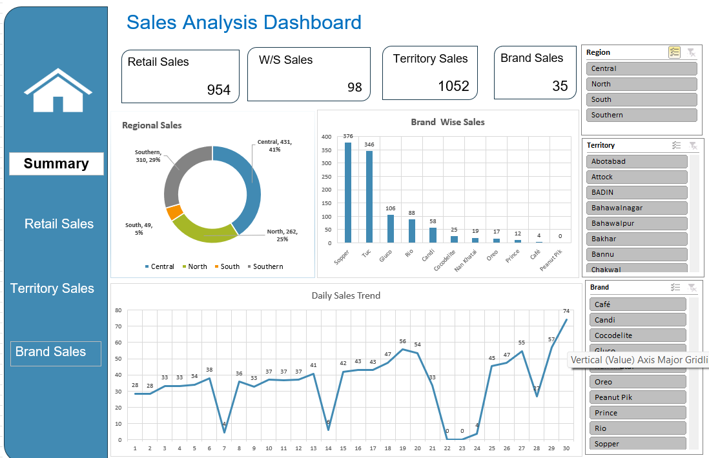

# Sales Analysis Dashboard (Excel)

An interactive Excel dashboard analyzing sales performance across regions, 
territories, and brands using Pivot Tables, Slicers, and dynamic charts.

## Overview
This dashboard tracks retail, wholesale, territory, and brand-level sales 
performance, with interactive filters for Region, Territory, and Brand. 
Built entirely in Excel to demonstrate data visualization and dashboard 
design skills.

## Tools Used
- Excel Pivot Tables & Pivot Charts
- Slicers (Region, Territory, Brand)
- Conditional Formatting
- Donut & Bar Charts
- Trend Line Chart

## Key Metrics (KPIs)
- Retail Sales: 954
- W/S (Wholesale) Sales: 98
- Territory Sales: 1052
- Brand Sales: 35

## Key Insights
- Central region leads with 41% share of total regional sales, followed by Southern (29%) and North (25%)
- Sopper and Tuc are the top-performing brands, far ahead of the rest
- Daily sales trend shows high volatility, with sharp dips around day 7, 14, and 22–24

## Dashboard Preview

## Author
Om Kshirsagar
